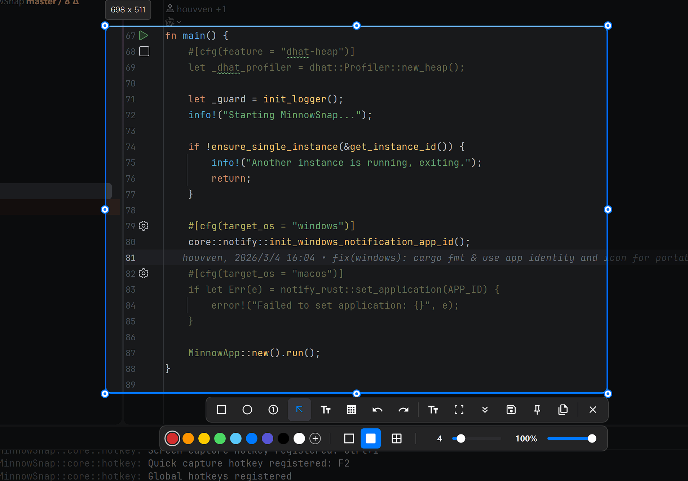

# MinnowSnap

MinnowSnap is a desktop screen capture tool built with Rust and GPUI. It focuses on fast capture, lightweight editing, and local post-processing for screenshots.

## Features

- Fast screen capture
- Simple annotation
- Local OCR
- QR code detection
- Copy, save, and pin

## Build

- Default build: `cargo build -p minnow-app --release`
- Portable build: `cargo build -p minnow-app --features portable --release`

Portable builds store app-internal data next to the executable in `data/`:

- `data/config.toml`
- `data/logs/`
- `data/temp/`
- `data/ocr_models/`

## TODO

- improvement long capture

## Credits

- [GPUI](https://github.com/zed-industries/zed/tree/main/crates/gpui)
- [xcap](https://github.com/nashaofu/xcap)
- [PaddleOCR](https://github.com/PaddlePaddle/PaddleOCR)
- [And more...](crates/minnow-app/Cargo.toml)
